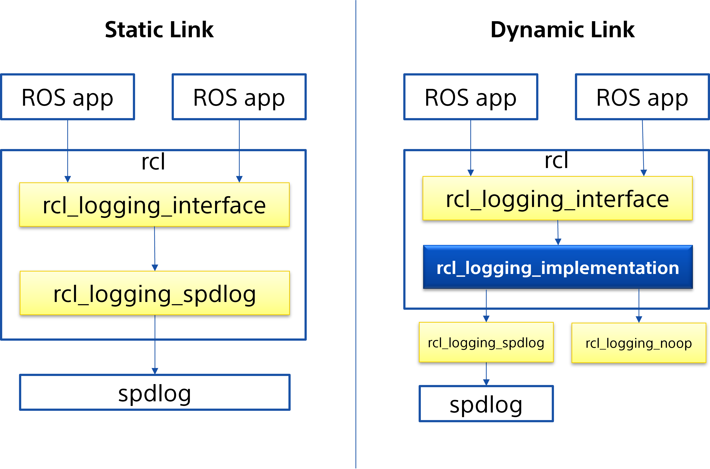

# Abstraction

This is a design document on how to implement the dynamic loading capability to plug in the logging implementation at runtime. Motivation and current problem is stated in the above issue header, which is the constraint for users not being allowed to change the logging implementation at runtime.

Basically what is missing here is the decoupling between `rcl_logging_interfaces` and logging implementation. This feature allows users to plugin their own logging implementation without any source build of rcl. some users do not have their own CI/CD pipeline, in that case this can be a burden. Similar to the above situation, even if users have our own CI/CD pipeline to build the entire ros2 packages as base system. The logging implementation can be different based on the production use case, that says individual requirements use different logging implementations. In this situation, we need to build the rcl package for each use case.

## Design

### rcl

Currently `rcl` fetches default `rcl_logging_spdlog` (implementation) via `get_default_rcl_logging_implementation`(CMake macro) from build argument or environment variable to bind with the rcl package for logging interfaces.

https://github.com/ros2/rcl/blob/9307eda336966386a1f67b0aef3f35a0e5549457/rcl/CMakeLists.txt#L22-L23
and add it to the target_link_libraries to the rcl project to build.
`test_logging.cpp` verifies generic `rcl_logging_interfaces` agnostic from the implementation.

Instead of binding the implementation in the build configuration, `rcl` should be linked with `rcl_logging_implementation` only. This gives the abstraction layer with `rcl_logging_implementation`, so that `rcl_logging_implementation` can load the implementation dynamically at runtime. (this is really similar approach with `rmw_implementation`)

Although this feature aims at having a dynamic loading mechanism for logging implementation at runtime, static build configuration should stay as opt-in build configuration. In this case, `rcl` should be built with the specified logging implementation such as `rcl_logging_spdlog` as it is. This leaves the current build behavior if users only rely on the specific logging implementation from `rcl`. And with that, runtime dynamic loading will be noop. This means that the current environment variable `RCL_LOGGING_IMPLEMENTATION` should stay if specified for build time.

### RCL_LOGGING_IMPLEMENTATION environment variable

This environmental variable has a couple of configurations for build time and runtime.
Build time: This configures rcl with static linking with specified logging implementation by users such as `rcl_logging_spdlog` and `rcl_logging_syslog`. This is opt-in configuration for build time to support the users who need to avoid the dynamic loading at runtime. Even if users specify the `RCL_LOGGING_IMPLEMENTATION` at runtime with other logging implementations, it should be ignored and logging implementation specified at build time should be honored.
Users can set this build configuration with CMake variable or environment variable at the build time. And if both of them are set, CMake variable prevails to environment variable.
Runtime: This configures dynamic loading logging implementation from `rcl_logging_implementation`. When this environment variable is set at runtime, `rcl_logging_implementation` will find the specified logging library to plug in. And then corresponding interfaces should be called from `rcl_logging_implementation`. If this is not set, it will always be `rcl_logging_spdlog` to load at runtime.

### rcl_logging_implementation

This is a new package added to https://github.com/ros2/rcl_logging. The main capability provided by this package is resolving the symbol for `rcl_logging_interface` to the logging implementation with dynamic loading. This package should be similar with `rmw_implementation`. It should resolve all logging interfaces with implementation via initialization, and bypass all the interfaces to the implementation. It should attempt to open the specified logging implementation by environment variable `RCL_LOGGING_IMPLEMENTATION` via initialization, and if not found it should return an error immediately. The default logging implementation to be loaded can be configured by the environment variable `DEFAULT_RCL_LOGGING_IMPLEMENTATION`. If this is not set, it falls back to `rcl_logging_spdlog` in default.
Since this package is going to be maintained and supported under https://github.com/ros2/rcl_logging repository, this must be able to support Tier 1 platform Ubuntu 24.04 (Noble) and Windows 10 (Visual Studio 2019) described in https://docs.ros.org/en/rolling/Releases/Release-Rolling-Ridley.html#currently-supported-platforms.

## Reference

- https://github.com/ros2/rcl/issues/1178
